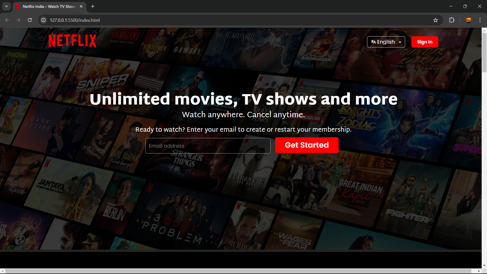

# Netflix Website Clone

## Description
This project is a clone of the popular streaming service Netflix, aimed at replicating its user interface and basic functionalities.

## Installation
To run this project locally, follow these steps:
1. Clone this repository to your local machine using `git clone https://github.com/shouryabansal103/Netflix-Clone.git`.
2. Open the `docs` folder in your code editor.
3. Open the `index.html` file in your web browser to view the website.

## Technologies Used
- HTML5
- CSS3 (with Flexbox and Grid layout)
- JavaScript (ES6+)

## Screenshots

## Credits
- Netflix for the inspiration and design.
- Icons from Font Awesome (https://fontawesome.com/).

## Contributing
Contributions are welcome! If you'd like to contribute to this project, please fork the repository, make your changes, and submit a pull request.
